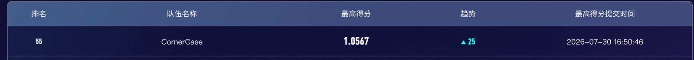
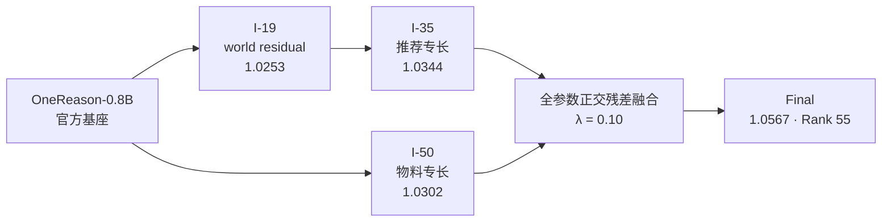

# LLM-Rec 2026 · Team CornerCase

> 🏆 **最终排名 55 / 1200（Top 4.6%） · 线上总分 1.0567**
>
> 基于官方 [OpenOneRec/OneReason-0.8B-pretrain-competition](https://huggingface.co/OpenOneRec/OneReason-0.8B-pretrain-competition)，完成从单模型 LoRA 到多能力正交融合的完整竞赛探索。



这个仓库记录了 Team CornerCase 在 LLM-Rec 2026 中的参赛历程：从官方基座出发，围绕“懂物料、懂用户、懂推荐、懂世界”四类能力，连续完成 I-01 至 I-74 的数据、训练、评测与融合实验，最终通过 **I-35 ⊕ I-50 全参数正交残差融合**取得 1.0567。

[方案详解](SOLUTION.md) ·
[完整实验记录](docs/EXPERIMENT_RECORDS_I41_I74.md) ·
[实验台账](docs/experiment_log.md) ·
[复现入口](scripts/reproduce)

## 最终方案：让两个专长模型互补

最终提交由两个能力侧重不同的 LoRA 模型组成：

- **I-35**：主攻懂推荐与 video-boundary，单模型线上 **1.0344**；
- **I-50**：主攻多教师懂物料，单模型线上 **1.0302**；
- **Final**：以 I-35 为主模型，只注入 I-50 中与 I-35 更新方向正交的部分，`λ = 0.10`。



对七类投影矩阵分别计算：

```text
ΔA = W_i35 − W_base
ΔB = W_i50 − W_base
R_B = ΔB − (⟨ΔB, ΔA⟩ / ‖ΔA‖²) · ΔA
W_fused = W_i35 + 0.10 · R_B
```

这里的关键不是把两个模型简单平均，而是：

1. 先把两个 LoRA 分别合并到同一个基座，得到真实的全参数增量；
2. 从 I-50 的增量中去掉与 I-35 平行的部分；
3. 只把剩余的正交方向以小比例注入 I-35；
4. 非目标权重继续保留 I-35。

这样既保住了 I-35 的推荐优势，又吸收了 I-50 的物料理解方向。最终分数相对最强单模型 I-35 提升 **+0.0223**。

## 从 0.6655 到 1.0567

我们没有依赖一次“大而全”的训练，而是持续拆分能力、验证假设，再把有效方向组合起来。

| 日期 | 阶段 | 线上总分 | 这一步解决了什么 |
|---|---|---:|---|
| 07-01 | 官方预训练锚点 | 0.6655 | 建立 OneReason-0.8B 的原始能力坐标 |
| 07-14 | I-13 s875 | 0.9978 | 两阶段 LoRA 与 residual scale 首次形成稳定主线 |
| 07-16 | I-23 seed_teacher_cotfix_v3 | 0.9915 | 得到 material 0.2760 的物料专长方向 |
| 07-19 | I-19 world residual r96 | 1.0253 | 用小残差补强懂世界，同时保持其他任务 |
| 07-22 | I-35 step548 r112 | 1.0344 | video-boundary residual 推高推荐能力，刷新单模型上限 |
| 07-23～07-24 | I-37 / I-40 | 1.0276 / 0.9891 | 证明直接扩张用户与推荐数据会产生明显任务干扰 |
| 07-30 | I-35 ⊕ I-50，λ=0.10 | **1.0567** | 用正交残差融合跨过单模型天花板 |

### 三个关键转折

**1. 从“继续训练一个模型”转向“学习小残差”。**

I-13、I-19 和 I-35 都说明：在已有强模型上训练低秩 residual，再控制注入比例，通常比重新训练一个大而全的 adapter 更容易保住原能力。

**2. 把失败实验当成能力冲突的证据。**

I-30、I-31、I-34、I-36、I-37、I-40 等路线没有成为最终提交，但它们帮助我们定位了 material、user 与 recommendation 之间的干扰关系，也促使方案从直接混合转向正交融合。

**3. 从 adapter 参数空间走向有效权重空间。**

LoRA 的 `A/B` 分解并不唯一。最终方案先计算 `B @ A` 对应的有效权重增量，再做投影与融合，使几何关系真正对应到模型权重变化。

更完整的 I-41～I-74 决策过程、失败路线和最终冲刺记录见
[docs/EXPERIMENT_RECORDS_I41_I74.md](docs/EXPERIMENT_RECORDS_I41_I74.md)。

## 官方基座与数据

本项目使用 OpenOneRec / OneReason 官方发布的模型与数据。建议直接从以下官方仓库获取：

| 资源 | 官方地址 | 用途 |
|---|---|---|
| OneReason-0.8B 竞赛基座 | [OpenOneRec/OneReason-0.8B-pretrain-competition](https://huggingface.co/OpenOneRec/OneReason-0.8B-pretrain-competition) | 所有 LoRA 训练与融合的共同基座 |
| Explorer LLM Rec Competition | [OpenOneRec/Explorer_LLM_Rec_Competition](https://huggingface.co/datasets/OpenOneRec/Explorer_LLM_Rec_Competition) | UserProfile、Pid2Sid、Pid2Caption、Pid2Tag、General 与官方 demo |
| General Pretrain | [OpenOneRec/OpenOneRec-General-Pretrain](https://huggingface.co/datasets/OpenOneRec/OpenOneRec-General-Pretrain) | OpenOneRec 官方通用预训练数据 |
| General SFT | [OpenOneRec/OpenOneRec-General-SFT](https://huggingface.co/datasets/OpenOneRec/OpenOneRec-General-SFT) | OpenOneRec 官方通用 SFT 数据 |
| OpenOneRec | [Kuaishou-OneRec/OpenOneRec](https://github.com/Kuaishou-OneRec/OpenOneRec) | 官方项目与生成式推荐背景 |
| OneReason Technical Report | [arXiv:2606.06260](https://arxiv.org/abs/2606.06260) | 模型、训练阶段与评测设计 |
| LLaMA-Factory | [hiyouga/LLaMA-Factory](https://github.com/hiyouga/LLaMA-Factory) | 本项目采用的训练框架 |

官方 demo 配置也直接使用
`OpenOneRec/OneReason-0.8B-pretrain-competition`：
[demo/config/demo.yaml](https://huggingface.co/datasets/OpenOneRec/Explorer_LLM_Rec_Competition/blob/main/demo/config/demo.yaml)。

## 复现路线

推荐先复现 I-13，再阅读 I-19、I-35 和最终融合。I-13 展示了这套方案中最核心的模式：

```text
官方基座
  └─ Stage 1：训练 rank-64 parent，3 epochs
       └─ Stage 2：训练 fresh rank-16 user residual，1 epoch
            └─ Stage 3：parent + 0.875 × residual → rank-80 adapter
```

### 1. 克隆仓库并下载官方基座

```bash
git clone https://github.com/tlysanhuo/llmrec_2026.git
cd llmrec_2026

python3 -m pip install -U huggingface_hub
hf download OpenOneRec/OneReason-0.8B-pretrain-competition \
  --local-dir models/OneReason-0.8B-pretrain-competition
```

需要重做 EDA 或数据构造时，可继续下载官方 Explorer 数据：

```bash
hf download OpenOneRec/Explorer_LLM_Rec_Competition \
  --repo-type dataset \
  --local-dir /path/to/Explorer_LLM_Rec_Competition
```

### 2. 验证并恢复 I-13 训练数据

```bash
python3 scripts/data/restore_i13_highscore_data.py --verify-only
scripts/reproduce/i13_highscore.sh restore-data
```

`--verify-only` 会检查发布包与解压内容的字节数、行数和 SHA256；`restore-data` 会把两阶段训练所需的 JSONL 恢复到对应 release 目录。

### 3. 准备训练环境

历史训练环境为 Linux、Python 3.11、PyTorch 2.7.1 + CUDA 12.6、LLaMA-Factory 0.9.6.dev0、FlashAttention 2.7.4.post1、Liger Kernel 0.8.0，单卡 H100。

安装 LLaMA-Factory 后，应用
[third_party/llama-factory-customizations](third_party/llama-factory-customizations/README.md)
中的 registry 与 parser 改动，并设置：

```bash
export LLAMAFACTORY_PYTHON=/path/to/llamafactory-venv/bin/python3
export LLAMAFACTORY_CLI=/path/to/llamafactory-venv/bin/llamafactory-cli
export WANDB_ENTITY=<your-entity>
export WANDB_PROJECT=<your-project>
```

### 4. 训练与组合 I-13

```bash
# Stage 1: rank-64 parent
CUDA_VISIBLE_DEVICES=0 "$LLAMAFACTORY_CLI" train \
  configs/active/i13_repro_parent_r64_ep3.yaml

# Stage 2: fresh rank-16 residual
CUDA_VISIBLE_DEVICES=0 "$LLAMAFACTORY_PYTHON" \
  scripts/train/train_user_residual_retkl.py \
  configs/active/i13_repro_residual_r16_retkl_ep1.yaml

# Stage 3: parent + 0.875 × residual
"$LLAMAFACTORY_PYTHON" scripts/train/combine_lora_adapters.py \
  checkpoints/i13_repro_parent_r64_ep3 \
  checkpoints/i13_repro_residual_r16_retkl_ep1 \
  checkpoints/i13_repro_combined_r80_s875 \
  --residual-scale 0.875 \
  --audit checkpoints/i13_repro_combined_r80_s875.audit.json
```

I-13 的数据、配置、公式与参考产物说明见
[e3_userres_r80_retkl_v3_s875](assets/derived/releases/e3_userres_r80_retkl_v3_s875/README.md)。

### 5. 复现最终融合

准备好推荐专长 adapter 与物料专长 adapter 后，运行全参数正交残差融合：

```bash
python3 scripts/train/full_weight_orthogonal_fuse.py \
  --model-a /path/to/recommendation_adapter \
  --model-b /path/to/material_adapter \
  --lambda 0.10 \
  --output /path/to/fused_model
```

融合实现见
[scripts/train/full_weight_orthogonal_fuse.py](scripts/train/full_weight_orthogonal_fuse.py)，
公式、模型角色和最终结果见 [SOLUTION.md](SOLUTION.md)。

## 仓库里有什么

| 路径 | 内容 |
|---|---|
| [SOLUTION.md](SOLUTION.md) | 最终方案、融合公式与成绩 |
| [docs/EXPERIMENT_RECORDS_I41_I74.md](docs/EXPERIMENT_RECORDS_I41_I74.md) | I-41～I-74 与最终冲刺记录 |
| [docs/experiment_log.md](docs/experiment_log.md) | I-01 之后的实验、线上分数与归因 |
| [docs/EXPERIMENT_INDEX.md](docs/EXPERIMENT_INDEX.md) | 模型、配置与实验索引 |
| [ideas](ideas/README.md) | 假设、EDA、选手分享与失败方案 |
| [assets/derived/releases](assets/derived/releases) | 可恢复的数据发布件与说明 |
| [scripts/data](scripts/data) | 数据构建、检查与恢复脚本 |
| [scripts/train](scripts/train) | 训练、LoRA 组合与融合实现 |
| [scripts/reproduce](scripts/reproduce) | 聚合后的复现入口 |
| [eval](eval/README.md) | 本地评测与指标实现 |
| [docs/streamlake](docs/streamlake/README.md) | 脱敏后的 StreamLake 实验快照 |

## 我们学到的几件事

- **多任务总分不等于每个任务都要在同一次训练里变强。** 先训练专长，再控制组合，往往更稳定。
- **LoRA residual 的比例本身就是重要超参数。** I-13 的 0.875、最终融合的 0.10 都来自实际的保持—增益权衡。
- **失败实验同样有价值。** 它们揭示哪些数据扩张会破坏已有能力，也帮助缩小最终融合的搜索空间。
- **融合应在有效权重上讨论。** 对 `B @ A` 做几何操作，比直接比较 LoRA 因子更符合模型真实变化。
- **实验纪律比盲目扫参重要。** 单变量实验、明确停止条件和完整记录，让 74 轮探索最终能够汇聚成一条清晰路线。

## 许可与致谢

本仓库自有代码按 [MIT License](LICENSE) 发布。模型、数据与训练框架遵循各自的上游许可证和赛事规则。

感谢 OpenOneRec / OneReason 团队、LLaMA-Factory、Hugging Face、PyTorch、Transformers、PEFT、vLLM 与 W&B 社区。使用本项目时，请同时引用对应的官方模型卡、数据卡与 OneReason Technical Report。
